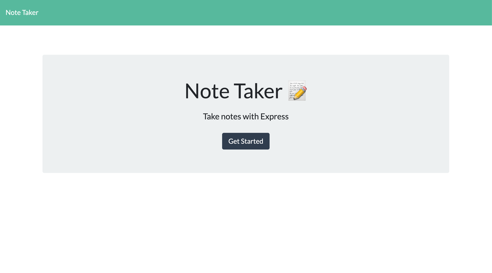
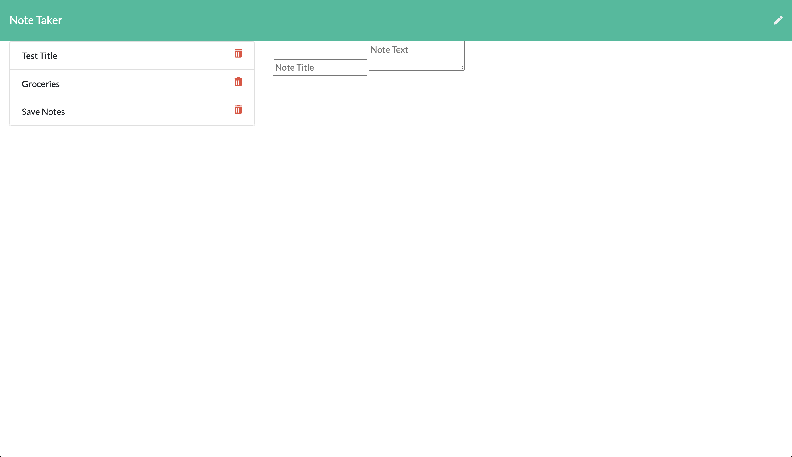
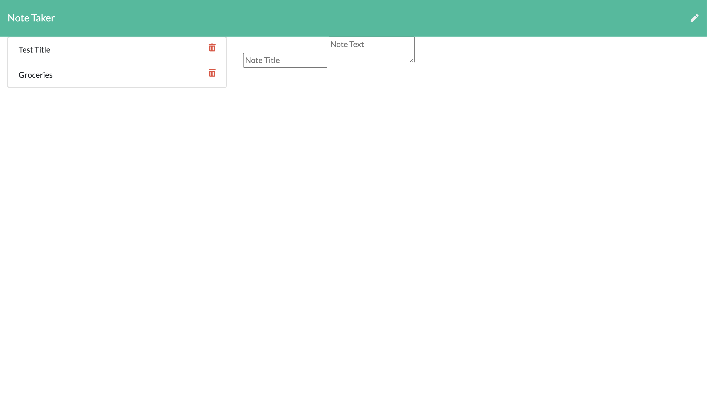
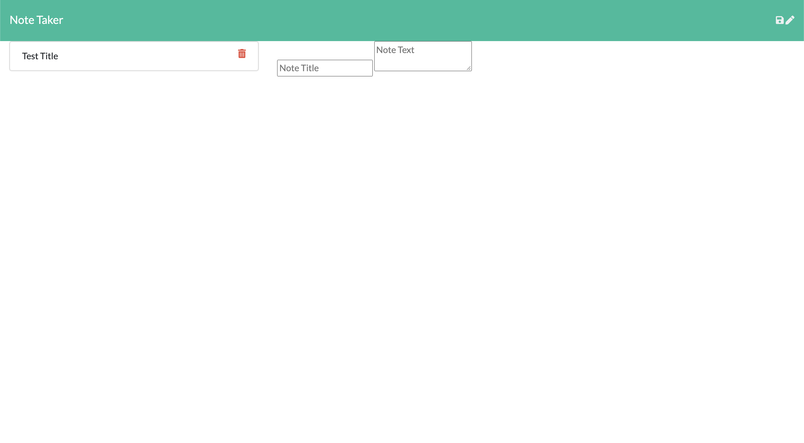

# NOTE TAKER

## Description
Note Taker is a backend web application that can be used to write, save, and delete notes in the brower including desktop, table and mobile platforms. Note Taker's backend was desgined with Express, a Node.js web appplication framework for web and mobile applications. The data-interchange format is powered by using JavaScript Object Notation (JSON) for its lightwieght applicability to generate, parse and transfer data structures to include:
 
* Objects
* Arrays
* Values
* Strings
* Number
* Whitesace

The fronted html are 'GET' routes, that return data to the *`notes`* and *`index`* files that are stored in a *`db.json`* file, and retrieved using the *`fs`* module files system on the backend. *`API's`* and the *`db.json`* are connected through a GET, POST, and DELETE request to supply a freeflowing data-interchanged environment for an overall efficeint experience to the application user. Note Taker is deployed throught the Herouku 

## Main Photo

## Screen Shots

| | |
|:-------------------------:|:-------------------------:|
|Landing Page|  Add Notes|
| Save Notes|  Delete Notes|

## Usage
## Installation
## Techonology
- [Express](https://expressjs.com/en/4x/api.html)
- [JSON](https://www.json.org/json-en.html)
- [Heroku](https://devcenter.heroku.com/categories/nodejs-support)
- [Node.js](https://nodejs.org/en/)
- [npmjs](https://docs.npmjs.com/)
- [Inquirer](https://www.npmjs.com/package/inquirer)
- [HTML](https://developer.mozilla.org/en-US/docs/Web/HTML)
- [CSS](https://developer.mozilla.org/en-US/docs/Web/CSS)

## License 
 
   *MIT License*

## Questions 

## Author
---
Payton Banks\
[payton.banks@gmail.com](mailto:payton.banks@gmail.com)\
[Github](https://github.com/paytonbanks)\
[LinkedIn](https://www.linkedin.com/in/payton-banks-341a8a/)

