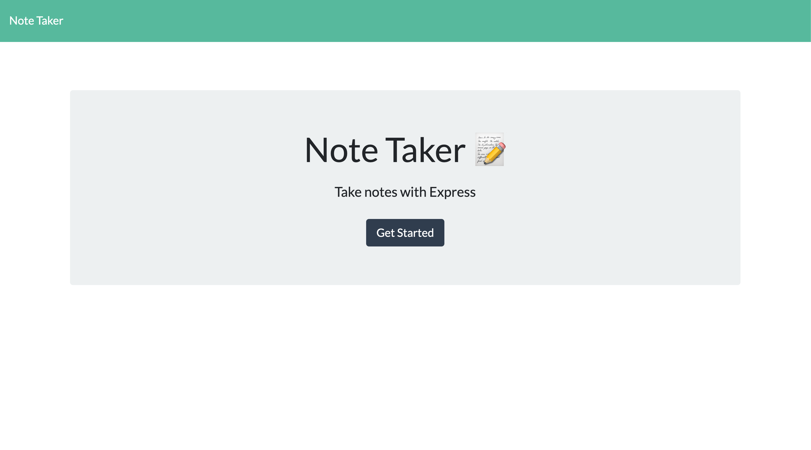
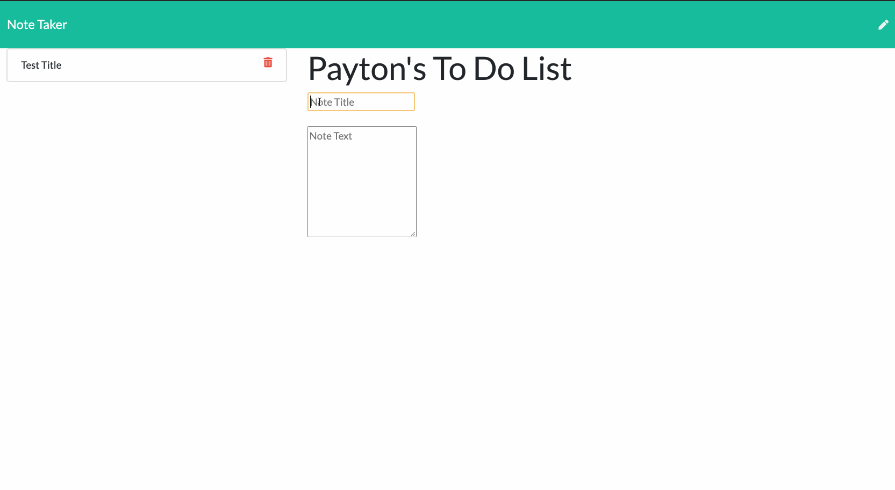
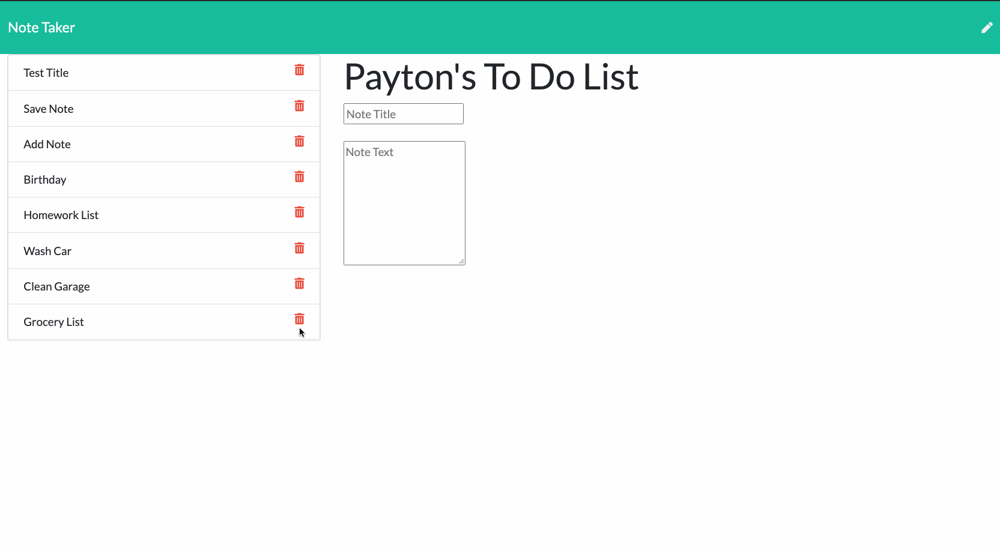
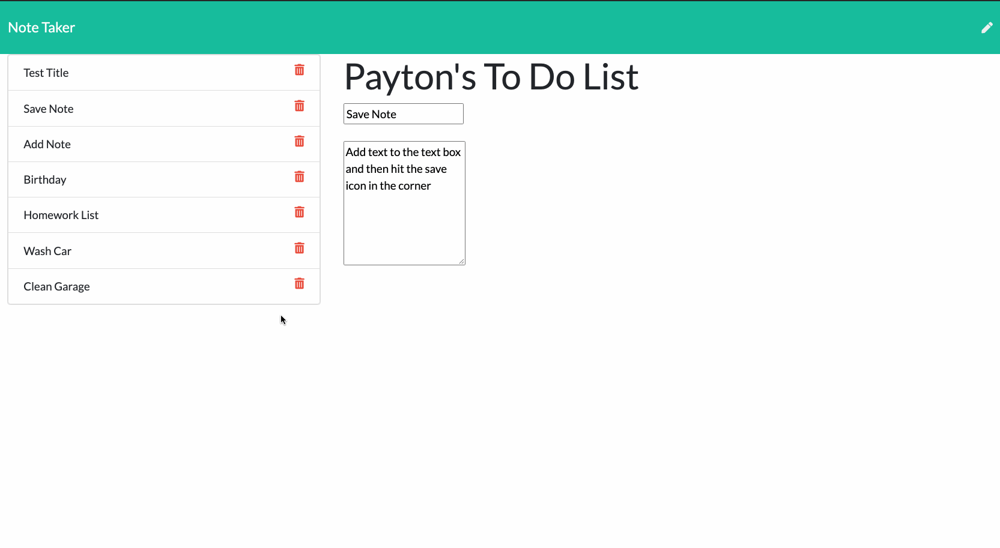

# NOTE TAKER

## Description
Note Taker is a backend web application that can be used to write, save, and delete notes in the brower including desktop, table and mobile platforms. Note Taker's backend was desgined with Express, a Node.js web appplication framework for web and mobile applications. The data-interchange format is powered by using JavaScript Object Notation (JSON) for its lightwieght applicability to generate, parse and transfer data structures to include:
<br>
* Objects
* Arrays
* Values
* Strings
* Number
* Whitesace

The fronted html are 'GET' routes, that return data to the *`notes`* and *`index`* files that are stored in a *`db.json`* file, and retrieved using the *`fs`* module files system on the backend. *`API's`* and the *`db.json`* are connected through a GET, POST, and DELETE request to supply a freeflowing data-interchanged environment for an overall efficeint experience to the application user. Note Taker is deployed throught the Herouku 

## Project Deployment
[Note Taker](https://tranquil-plateau-56346.herokuapp.com/notes.html)

## Landing Page
<span style="display:block;text-align:center"></span>

### *Screen Shots*
 Save Note
 View Notes
 Delete Notes

## Installation
* When you first set up the project, open up the integrated terminal in VS Code and navigate to the root directory of your project. If there is not a package.json then input:  
```npm init ```

* A package.json file should appear. Then enter the following into your terminal:  
```npm install express --save ```

* Then enter the following into your terminal:  
```npm install nodemon --save ```

* To utilize Bootstrap components, grid, and other styles, insert the following link into the head of your html document:

```html
    <link rel="stylesheet" href="https://stackpath.bootstrapcdn.com/bootstrap/4.5.2/css/bootstrap.min.css"
    integrity="sha384-JcKb8q3iqJ61gNV9KGb8thSsNjpSL0n8PARn9HuZOnIxN0hoP+VmmDGMN5t9UJ0Z" crossorigin="anonymous">
```
* To utilize the jQuery library insert the following script at the bottom of the body of your html document:

```html
      <script src="https://cdnjs.cloudflare.com/ajax/libs/jquery/3.3.1/jquery.min.js"></script>
```

* To utilize Font Awesome, insert the following link into the head of your html document:

```html
               <link rel="stylesheet" href="https://use.fontawesome.com/releases/v5.8.1/css/all.css"
        integrity="sha384-50oBUHEmvpQ+1lW4y57PTFmhCaXp0ML5d60M1M7uH2+nqUivzIebhndOJK28anvf" crossorigin="anonymous" />

```


## Techonology
- [Express](https://expressjs.com/en/4x/api.html)
- [JSON](https://www.json.org/json-en.html)
- [Heroku](https://devcenter.heroku.com/categories/nodejs-support)
- [Node.js](https://nodejs.org/en/)
- [npmjs](https://docs.npmjs.com/)
- [Inquirer](https://www.npmjs.com/package/inquirer)
- [HTML](https://developer.mozilla.org/en-US/docs/Web/HTML)
- [CSS](https://developer.mozilla.org/en-US/docs/Web/CSS)

## License 
 
 <br> *MIT License*

## Questions<br>

## Author
---
Payton Banks\
[payton.banks@gmail.com](mailto:payton.banks@gmail.com)\
[Github](https://github.com/paytonbanks)\
[LinkedIn](https://www.linkedin.com/in/payton-banks-341a8a/)

